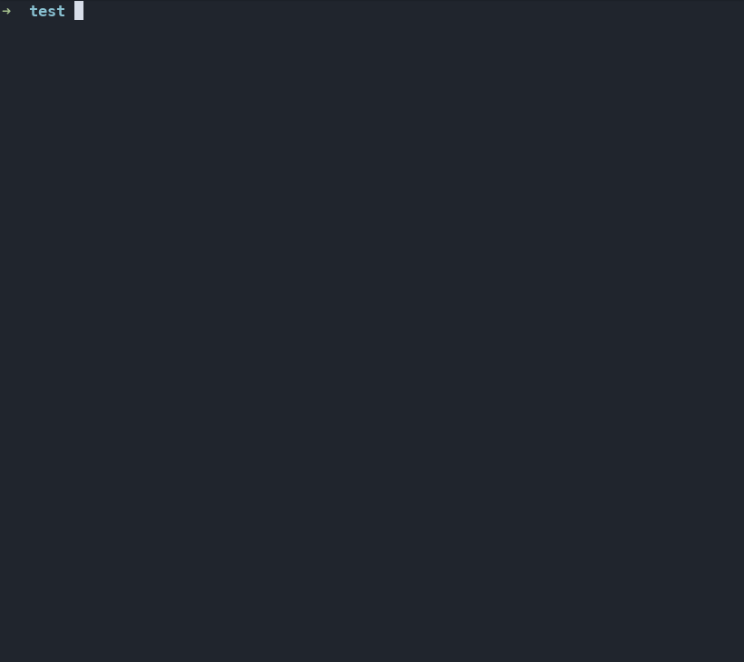

# Console Runner

Console Runner to do:
1. README
2. Tests
3. Part1 and part2 split
4. Multiline logs
5. Console resize https://docs.rs/signal-hook/0.1.6/signal_hook/index.html SIGWINCH
6. Console input messes up the output

rustup override set nightly
cargo run